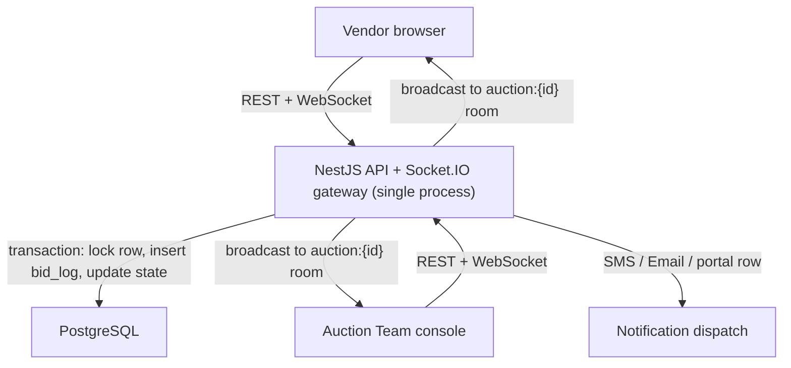

# ProcEaze — Auction Module: Technical Specification (v1)

**Status:** Draft for build — v1 scope only
**Owner:** Jaimin (Product & Business Analyst, Veracity Supply Chain)
**Traces to:** ProcEaze Auction Portal BRD — FR-29 to FR-41, BR-06, BR-07
**Reference artifact:** `ProcEaze-Auction-Module-Prototype.html` (interactive HTML prototype, already built and validated — this spec formalizes it into a real system and corrects two gaps found during review, see §6.1 and §3)

---

## 1. Purpose and how to use this document

This is the single source of truth for building the Auction module as a real, deployable service. It exists to be handed to an engineering agent (Claude Code) or a developer with no other context and produce a correct v1 build without re-litigating decisions that have already been made.

Rules for using this document:
- Where this doc states a rule, it is final for v1 — do not "improve" on it without flagging the change and why.
- Where this doc explicitly says a topic is **deferred**, do not build speculative support for it. Leave a clean extension point (noted per item in §17) and move on.
- Where this doc is silent on something not listed in §17, that's a genuine gap — stop and ask rather than guessing, especially for anything touching money, ranking, or the audit log.

---

## 2. V1 scope

| In scope for v1 | Explicitly out of scope for v1 |
|---|---|
| Manual referral entry by Auction Team (no PR/RFQ system integration) | Automated referral trigger from a TC/RFQ system (doesn't exist yet) |
| English Reverse auctions, full engine | Split-award automation |
| Japanese Descending Clock auctions, full engine | Weighted/"transformation" bidding (freight, lead time, etc.) |
| Auction Team console (own login) | SSO / enterprise IdP integration |
| Vendor bidding console (own login, own vendor table) | Vendor Master integration |
| SMS + Email + in-portal notifications to vendors | TC-side notifications (no TC system to notify yet) |
| On-screen ranking + CSV audit export | Signed / tamper-evident PDF "minutes of auction" |
| Manual emergency-stop of a live auction | Vendor mid-auction suspension/blacklisting |
| Auction cancellation with vendor notification | Live per-vendor connection-status monitoring |
| One bidding seat per vendor **company** | Multiple simultaneous independent bids from the same company |
| Desktop web only | Mobile-optimized vendor portal |
| Single-server deployment, free-tier hosting | Multi-region / high-availability infrastructure |

---

## 3. Roles and permissions (final)

| | Auction Team | Vendor |
|---|---|---|
| Roles | One shared role — no sub-roles, no maker-checker | One shared role per company |
| Referral entry | Manual, by any Auction Team member | — |
| Configure auction | Yes, until go-live | No |
| Go live / close now / cancel | Yes | No |
| See ceiling / starting price | Always | Always (BR-07) |
| See reserve price | Always | **Never**, at any visibility setting |
| See other bidders' prices | Always, real company names | Only if visibility = full price; **never** real identity — always shown as "Bidder A/B/C" regardless of price-visibility setting |
| See own bid / rank | N/A | Always |
| See vendor headcount in an auction | Always | Yes — this is not treated as sensitive |
| Change visibility setting | Only before go-live — **locked once live** | — |
| Submit / withdraw a bid | No | Submit only — **no withdrawal, ever, once accepted** |
| Audit log, full + export | Yes | No |
| Send result onward | Yes (single action, no approval step) | — |

**Vendor seat model:** a vendor **company**, not an individual login, holds one bidding position per auction. If more than one person from the same company logs in during a live auction, the first to open the live console claims the seat (writes `auction_seats.joined_by_user_id`); any other login from that company sees the same company's live position **read-only** until the seat is released (auction ends, or the controlling session disconnects and a timeout — see §17 — clears the seat). Do not build per-user independent bidding within one company.

---

## 4. Business rules — English Reverse

1. **Ceiling price** is the starting baseline and is visible to every vendor throughout (BR-07).
2. **Decrement rule** — every accepted bid, *including the vendor's first bid*, must be at least `decrement_value` below that vendor's previous accepted bid, or below the ceiling if they have no prior bid. There is no exception for a "first bid restates the RFQ price" case — the ceiling is always the baseline.
3. **No withdrawal.** An accepted bid can never be retracted or edited.
4. **Duration, auto-extension, decrement type/value, max extensions** are all fully configurable per auction. There is no platform-wide ceiling on any of these values.
5. **Anti-sniping auto-extension**: if a valid bid lands within `trigger_window_sec` of the current end time, extend by `extension_length_sec`, up to `max_extensions`. Log every extension as a system row in the bid log.
6. **Manual emergency stop**: the Auction Team can close a live English auction immediately via an explicit "Close auction now" action. This is a deliberate v1 addition (not in the original BRD text) — log it as a distinct system event, clearly distinguishable in the audit log from a natural timer-elapsed close.
7. **Ranking** is always a computed view over `bid_log`, ordered by lowest latest-accepted-bid, tie-broken per the configured `tie_break_rule` (earliest timestamp, or flagged for manual review). Never store rank as an independently editable field.
8. **A single-bidder outcome is a valid, awardable result.** Show a non-blocking warning in the review screen; do not block sending it onward.
9. **Zero bids at close** is a distinct terminal state (`closed_no_bids`), not a ranked result. It routes back to manual/direct vendor selection outside this module — do not attempt to auto-select or re-run.

## 5. Business rules — Japanese Descending Clock

1. **Starting price and floor price** are both visible to vendors throughout.
2. Each tick: price drops by `tick_decrement`; a `response_window_sec` window opens; every still-active vendor must confirm Stay or Drop.
3. **No response within the window** → auto-dropped at that tick's price if `auto_drop` is on. If `auto_drop` is off, a non-response is treated as an **implicit stay** — this is a v1 assumption filling a gap the original BRD left open; flag it in the UI as such (already done in the prototype) and revisit if it causes a real dispute.
4. **A drop is permanent.** No re-entry into the same auction.
5. **The minimum-vendor-remaining check applies uniformly**, including if it would trigger on the very first tick. There is no special-case early exit that skips the check.
6. **Floor price is a hard stop.** The call price never drops below it, even if two or more vendors are still active and willing to go lower. The auction finalizes at the floor if that's reached before the minimum-vendor threshold.
7. **Ranking**: vendors still active at close share the best rank at the final call price (tied, flagged for the Auction Team to resolve if more than one). Eliminated vendors rank by drop price ascending — a lower drop price means they survived longer.

## 6. Cross-cutting rules

### 6.1 Visibility and anonymity — correction from the prototype
The HTML prototype showed real competitor names to other vendors under "full price" visibility. **This is wrong for the real build.** The rule for v1:
- `visibility = full` → vendors see every bid's **price**, but every other bidder is labeled "Bidder A", "Bidder B", etc. — never a real company name.
- `visibility = rank_only` → vendors see only their own rank, no other prices, no other identities.
- The Auction Team's internal console **always** sees real names and full prices, regardless of the auction's visibility setting.
- Visibility is set at configuration time and **locked once the auction goes live** — no mid-auction changes.

### 6.2 Referral, single-auction, and cancellation
- Referral into this module is a **manual data-entry action** by the Auction Team — there is no API/event trigger from a PR/RFQ system in v1.
- Exactly **one auction per referred thread.** No splitting into multiple lots/auctions in v1.
- The Auction Team can **cancel** a configured-or-live auction. On cancellation: the auction's `bid_log` is preserved as-is (append a `cancelled` system row, never delete history), status becomes `cancelled`, and every invited vendor is notified through all three channels (§13).

### 6.3 NDA / bidder agreement
- A vendor must explicitly accept an NDA/bidder agreement **once, ever** — not per auction. Store `vendors.nda_accepted_at`. Gate the vendor's very first bid submission (any auction) on this being non-null; if null, redirect to an acceptance screen before allowing the bid.

### 6.4 Notifications
SMS, email, and an in-portal notification are all sent for vendor-facing events (§13). There is no TC-side notification in v1 — because there's no TC/RFQ system yet to notify, "sending the result" simply changes the thread's status inside this module for the Auction Team to see; wiring it to an actual external notification is deferred until that integration exists (§17).

---

## 7. Tech stack

No stack is mandated — this is a free technical choice for v1, optimized for: a single developer/agent being able to build and reason about it, low/no hosting cost, and an easy path to swap in real auth and Vendor Master integration later without a rewrite.

| Layer | Choice | Why |
|---|---|---|
| Backend | Node.js + TypeScript, **NestJS** | Opinionated module/controller/service structure — easiest for an agent to scaffold consistently and for a future developer to navigate |
| Real-time | **Socket.IO** | Built-in room support maps directly onto "one room per `auction_id`" — far less custom code than raw WebSockets |
| Database | **PostgreSQL** | Real transactions and row locking are required for bid-race correctness (§11) — this is not a place for an eventually-consistent store |
| ORM | **Prisma** | Type-safe schema + migrations; makes the schema in §9 directly generatable and safely evolvable |
| Frontend | **React + TypeScript + Vite** | Fast dev loop, straightforward free static hosting |
| Auth (v1) | Real username/password login, **own tables**, bcrypt-hashed passwords, JWT or server session | Both SSO (Auction Team) and Vendor Master (vendors) explicitly don't exist yet — build real, working login now, designed to be swapped later (§16) |
| Notifications | Email via a free-tier transactional provider (Resend / Brevo); SMS via an India-friendly gateway (MSG91 / Fast2SMS) | Low-cost, India-appropriate for the vendor base |
| Hosting | Frontend: Vercel or Netlify (free). Backend: Render, Railway, or Fly.io (free tier — **must** support a persistent Node process for WebSockets, not a serverless function platform). DB: Neon or Supabase (free managed Postgres) | Matches "somewhere free"; flagged tradeoff below |

**Free-tier tradeoff, stated plainly:** most free web-service tiers spin the backend down after a period of inactivity and cold-start on the next request (10–30s delay). Acceptable for a pilot with 8–10 concurrent vendors; revisit before any real-money go-live at scale.

**No Redis / no multi-node in v1.** At the stated peak load (8–10 vendors live), a single Node process holding the auction engine in memory (backed by Postgres as the durable source of truth) is sufficient and simpler to build and reason about correctly. Redis pub/sub only becomes necessary the day you run more than one backend instance — see §16 for exactly what changes when that day comes.

---

## 8. Architecture (v1)



One process owns the in-memory timer/tick loop for every live auction (a plain `setInterval`-driven engine, same logic already validated in the prototype's `engineTick()`), and that same process is the only writer to Postgres for auction state. Because there is exactly one process in v1, there is no risk of two nodes double-processing the same tick — that risk only appears when you scale horizontally (§16).

---

## 9. Data model

```prisma
model AuctionTeamUser {
  id           String   @id @default(uuid())
  name         String
  email        String   @unique
  passwordHash String
  isActive     Boolean  @default(true)
  createdAt    DateTime @default(now())
}

model Vendor {
  id                  String    @id @default(uuid())
  companyName         String
  city                String?
  email               String    @unique
  passwordHash        String
  registeredCategories String[]
  ndaAcceptedAt       DateTime?
  isActive            Boolean   @default(true) // reserved for future suspension — not enforced in v1
  createdAt           DateTime  @default(now())
}

enum ThreadStatus {
  referred
  live
  closed_pending_review
  closed_no_bids
  cancelled
  sent_to_tc
}

model PrThread {
  id               String       @id @default(uuid())
  threadCode       String       @unique   // e.g. "THR-2031" — human-facing
  title            String
  category         String
  purchaseCode     String
  department       String
  costCentre       String
  tcBuyerName      String       // free text — no TC system to FK against yet
  qtyDescription   String
  referralNote     String?
  resultsNeededBy  DateTime?
  status           ThreadStatus @default(referred)
  createdById      String
  createdAt        DateTime     @default(now())
  updatedAt        DateTime     @updatedAt
  auction          Auction?
}

enum AuctionFormat { english japanese }
enum AuctionStatus { draft_configuring live closed_pending_review closed_no_bids cancelled sent_to_tc }

model Auction {
  id             String        @id @default(uuid())
  prThreadId     String        @unique
  prThread       PrThread      @relation(fields: [prThreadId], references: [id])
  format         AuctionFormat
  status         AuctionStatus @default(draft_configuring)
  createdById    String
  createdAt      DateTime      @default(now())
  startedAt      DateTime?
  endedAt        DateTime?
  cancelledAt    DateTime?
  cancelledById  String?
  cancelReason   String?
  sentToTcAt     DateTime?
  sentToTcById   String?

  configEnglish  AuctionConfigEnglish?
  configJapanese AuctionConfigJapanese?
  invitees       AuctionInvitee[]
  seats          AuctionSeat[]
  bidLog         BidLogEntry[]
  results        AuctionResult[]
}

enum DecrementType { absolute percentage }
enum Visibility { full rank_only }
enum TieBreakRule { earliest manual }

model AuctionConfigEnglish {
  auctionId        String        @id
  auction          Auction       @relation(fields: [auctionId], references: [id])
  ceilingPrice     Decimal
  decrementType    DecrementType
  decrementValue   Decimal
  durationSec      Int
  autoExtend       Boolean
  triggerWindowSec Int?
  extensionLengthSec Int?
  maxExtensions    Int?
  visibility       Visibility
  reservePrice     Decimal?      // NEVER serialize to a vendor-facing API response
  tieBreakRule     TieBreakRule
  currentEndsAt    DateTime?     // mutable — the authoritative countdown target
  extensionsUsed   Int           @default(0)
}

enum AuctionPhase { awaiting_response transition }

model AuctionConfigJapanese {
  auctionId           String       @id
  auction             Auction      @relation(fields: [auctionId], references: [id])
  startingPrice       Decimal
  floorPrice          Decimal
  tickDecrement       Decimal
  tickIntervalSec     Int
  responseWindowSec   Int
  autoDrop            Boolean
  minVendorsRemaining Int
  currentCallPrice    Decimal?
  currentPhase        AuctionPhase?
  currentWindowEndsAt DateTime?
  tickToken           Int          @default(0) // guards stale async callbacks across ticks
}

model AuctionInvitee {
  auctionId String
  vendorId  String
  invitedAt DateTime @default(now())
  isActive  Boolean  @default(true)
  @@id([auctionId, vendorId])
}

model AuctionSeat {
  auctionId           String
  vendorId            String
  active              Boolean  @default(true)
  lastBidPrice        Decimal?
  dropPrice           Decimal?
  respondedThisWindow Boolean  @default(false)
  joinedByUserId       String?  // which vendor login currently controls this company's seat
  @@id([auctionId, vendorId])
}

enum BidLogType { bid stay drop system cancelled }

model BidLogEntry {
  id            BigInt     @id @default(autoincrement())
  auctionId     String
  auction       Auction    @relation(fields: [auctionId], references: [id])
  vendorId      String?
  actedByUserId String?
  type          BidLogType
  price         Decimal?
  message       String?
  createdAt     DateTime   @default(now()) // SERVER time only — never accept a client-supplied timestamp
}
// DB permission note: REVOKE UPDATE, DELETE ON "BidLogEntry" FROM app_role;
// Only INSERT is ever permitted on this table, at the database grant level, not just in application code.

model BidAttemptRejected {
  id              BigInt   @id @default(autoincrement())
  auctionId       String
  vendorId        String
  attemptedPrice  Decimal
  reason          String
  createdAt       DateTime @default(now())
}

model AuctionResult {
  auctionId  String
  vendorId   String
  rank       Int?
  finalRate  Decimal?
  computedAt DateTime @default(now())
  @@id([auctionId, vendorId])
}

enum NotifRecipientType { vendor auction_team }
enum NotifChannel { sms email portal }
enum NotifEvent { auction_live auction_cancelled auction_closed_result single_bidder_alert }

model Notification {
  id            String             @id @default(uuid())
  recipientType NotifRecipientType
  recipientId   String
  channel       NotifChannel
  eventType     NotifEvent
  payload       Json
  sentAt        DateTime           @default(now())
  readAt        DateTime?          // portal notifications only
}
```

---

## 10. API contract

### REST

| Method & path | Caller | Purpose |
|---|---|---|
| `POST /auth/team/login` | Auction Team | Real login, returns session/JWT |
| `POST /auth/vendor/login` | Vendor | Real login, returns session/JWT |
| `POST /auth/vendor/accept-nda` | Vendor | One-time NDA acceptance gate |
| `GET /api/threads` | Auction Team | List referred threads, filterable by status |
| `POST /api/threads` | Auction Team | Manual referral entry |
| `POST /api/auctions` | Auction Team | Create draft config (format + invitees) for a thread |
| `PATCH /api/auctions/:id/config` | Auction Team | Edit config, only while `draft_configuring` |
| `POST /api/auctions/:id/go-live` | Auction Team | Transition to `live`, starts the engine |
| `POST /api/auctions/:id/close-now` | Auction Team | Manual emergency stop |
| `POST /api/auctions/:id/cancel` | Auction Team | Cancel + notify vendors |
| `POST /api/auctions/:id/send-result` | Auction Team | Explicit hand-off (BR-06) |
| `GET /api/auctions/:id/state` | Auction Team | Full internal snapshot — real names, reserve included |
| `GET /api/auctions/:id/audit-log` | Auction Team | Full bid log |
| `GET /api/auctions/:id/audit-log/export` | Auction Team | CSV export |
| `GET /api/vendor/auctions` | Vendor | Only auctions this vendor's company is invited to |
| `GET /api/vendor/auctions/:id/state` | Vendor | Anonymized snapshot — no reserve, competitors masked |
| `POST /api/vendor/auctions/:id/bid` | Vendor | English bid submission |
| `POST /api/vendor/auctions/:id/respond` | Vendor | Japanese stay/drop `{action}` |

All mutating vendor endpoints re-validate everything server-side (price, decrement, window timing) regardless of what the client believes — the client is never trusted (§12).

### WebSocket (Socket.IO, one room per `auction:{auctionId}`)

| Direction | Event | Payload gist |
|---|---|---|
| Client → Server | `join_auction` | `{auctionId}` |
| Server → Client | `state_snapshot` | Full current state, role-scoped |
| Server → Client | `bid_accepted` | New bid, updated leaderboard |
| Server → Client | `rank_changed` | Vendor-scoped: "your rank is now L2" |
| Server → Client | `tick_advanced` / `window_opened` / `window_closed` | Japanese clock progression |
| Server → Client | `vendor_dropped` | Japanese drop event |
| Server → Client | `auction_extended` | New `currentEndsAt` |
| Server → Client | `auction_closed` / `auction_cancelled` | Terminal state + reason |

Bids and stay/drop actions go over REST, not the socket — this keeps validation in one place (the REST handler) and the socket purely as a push channel, avoiding duplicate validation logic in two transports.

---

## 11. Real-time timer and sync design

- The server holds the only authoritative `currentEndsAt` (English) / `currentWindowEndsAt` + `tickToken` (Japanese).
- On `join_auction`, the client receives `{serverNow, ...}` and computes a clock offset; it renders the countdown locally between pushes but always defers to the next authoritative broadcast.
- Every accepted bid or tick event happens inside one Postgres transaction: lock the relevant auction's mutable state, validate, insert into `BidLogEntry`, update the mutable config row, commit, then broadcast. This ordering is what prevents two near-simultaneous bids from both validating against a now-stale leader price (§12).
- On reconnect (dropped WebSocket), the client calls `GET /state` for a full snapshot before resuming the socket stream, so a missed event never leaves it silently stale.

---

## 12. Security baseline for v1

- Passwords bcrypt-hashed, never logged or returned.
- All traffic over HTTPS/WSS.
- Every bid/response re-validated server-side against the current DB state under a lock — the client-side check is UX only.
- `BidLogEntry` is INSERT-only at the database grant level.
- Rejected bid attempts are logged (`BidAttemptRejected`) for anomaly review, even though no automated blocking acts on them in v1.
- Reserve price is never included in any vendor-facing API response — enforced by using a distinct response serializer for the vendor endpoints, not by client-side hiding.
- Rate-limit login and bid-submission endpoints.
- MFA is **off** for v1 (explicit tradeoff — revisit before scaling beyond a pilot).

---

## 13. Notifications

Channels: SMS, email, and an in-portal notification row (surfaced via a bell icon backed by `Notification.readAt`), for every event below, to vendors only:

| Event | Trigger |
|---|---|
| `auction_live` | On go-live, to every active invitee |
| `auction_cancelled` | On cancellation, to every active invitee |
| `auction_closed_result` | On auction close, to the vendor's own outcome only (not to competitors) |
| `single_bidder_alert` | Internal — to Auction Team, portal only, when an auction is running with exactly one active bidder |

There is no `send-result`-triggered notification to TC in v1 — no external system exists yet to receive it (§17).

---

## 14. Screen inventory

Eight screens total — this matches the already-built HTML prototype exactly; use it as the interaction/visual reference (colors, type, layout) rather than re-designing from scratch.

| # | Screen | Role | Notes vs. prototype |
|---|---|---|---|
| 1 | Login | Both | Real form now, not a role-picker |
| 2 | Auction Desk (queue) | Auction Team | Add manual "New referral" entry form (§6.2) |
| 3 | Configure Auction | Auction Team | Same fields as prototype |
| 4 | Live Console — internal | Auction Team | Add "Close auction now" and "Cancel auction" controls |
| 5 | Result Review / Send to TC | Auction Team | Same as prototype; no maker-checker step |
| 6 | My Auctions | Vendor | Same as prototype |
| 7 | Live Bidding Console | Vendor | **Anonymize competitor names** even under full-price visibility (§6.1 fix) |
| 8 | Closed/Outcome view | Vendor | Same as prototype |

---

## 15. Deployment plan (v1, free tier)

1. Frontend → Vercel or Netlify, static build.
2. Backend → Render, Railway, or Fly.io — pick whichever gives a persistent Node process (not a serverless function product) so Socket.IO connections stay alive.
3. Database → Neon or Supabase free Postgres.
4. Environment variables for DB URL, JWT secret, email/SMS provider keys — no secrets committed to the repo.
5. No CI/CD pipeline mandated for v1; a simple "push to main deploys" flow on the chosen host is sufficient at this stage.

---

## 16. Migration hooks — designed for "we'll link it later"

Three things in this system are explicitly temporary stand-ins, and the schema is deliberately shaped so swapping them later doesn't touch business logic:

- **Auction Team auth** → `AuctionTeamUser` is its own table today. When a real ProcEaze SSO/user pool exists, add an `externalUserId` column, populate it via a one-time reconciliation by email match, and swap the login endpoint's implementation — the `id` used everywhere else in the schema (as `createdById`, `actedByUserId`, etc.) doesn't need to change.
- **Vendor identity** → same pattern: `Vendor` gets an `externalVendorMasterId` column when Vendor Master is ready. `vendorId` foreign keys elsewhere are untouched.
- **Referral trigger** → today, `POST /api/threads` is called manually from the UI. Once a real PR/RFQ system exists, that system can call the same endpoint (or a thin adapter in front of it) as a webhook — the rest of the module doesn't need to know the difference.
- **Horizontal scaling** → if you ever run more than one backend instance, the single-process in-memory engine (§8) needs to become: (a) a Redis-based lock keyed by `auctionId` so only one instance drives a given auction's timer, and (b) Redis pub/sub to fan state changes out to whichever instance holds a given vendor's WebSocket connection. Nothing about the data model changes — only where the tick loop and broadcast live.

---

## 17. Known gaps — explicitly deferred, not built in v1

| Gap | v1 behavior | Why deferred |
|---|---|---|
| Vendor suspension mid-auction | Not handled | Explicitly parked — no rule given yet |
| Live per-vendor connection status | Not shown | Adds real complexity for a pilot at 8–10 vendors |
| Grace reconnect window | None — standard timeout/auto-drop rules apply | Same as above |
| Crash recovery | Engine resumes from last committed DB state on restart; a few seconds may be lost | Acceptable at pilot scale; full replay-safety is a later hardening pass |
| Audit log retention period | Kept indefinitely | No statutory number given yet |
| Signed/tamper-evident export | Plain CSV only | Explicitly confirmed sufficient for v1 |
| MFA for vendors | Off | Real tradeoff, flagged for revisit |
| Maker-checker on sending result | None | One shared role, no approval step |
| Split-award automation | None | TC handles splits manually, outside this module |
| Multi-currency | INR only | Not needed yet |
| TC-side notification on result sent | None | No TC system exists yet to notify |
| Seat-release timeout when a controlling vendor session disconnects | Not fully specified — needs a concrete timeout value before build | Flagging this one specifically: pick a number (e.g., 60s of disconnect) before this ships, otherwise a dropped connection can strand a company's seat for the rest of the auction |

---

## 18. Traceability to the original BRD

| BRD reference | Where it's covered here |
|---|---|
| FR-29 – FR-34 (configuration, format-specific fields, go-live immediacy) | §4, §5, §9 (`AuctionConfigEnglish` / `AuctionConfigJapanese`) |
| FR-35 (bid rejection with reason) | §4.2, §12 |
| FR-36 (visibility) | §6.1 |
| FR-37 (Japanese response handling) | §5 |
| FR-38 (auto-close conditions) | §5.5, §5.6 |
| FR-39 (immutable, computed ranking) | §9 (`BidLogEntry` grant note), §4.7 |
| FR-40 / FR-41 (explicit hand-off) | §6.2, §13 |
| BR-06 (control transfers only at explicit points) | §6.2, §13 |
| BR-07 (ceiling/starting price always visible) | §4.1, §5.1 |
